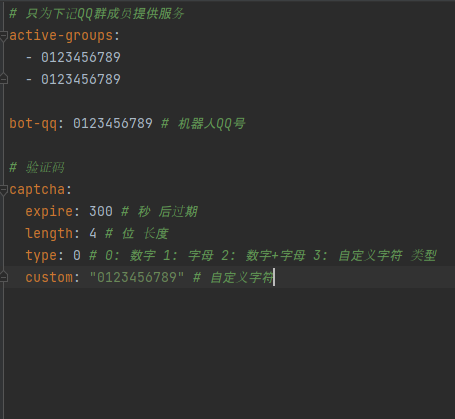
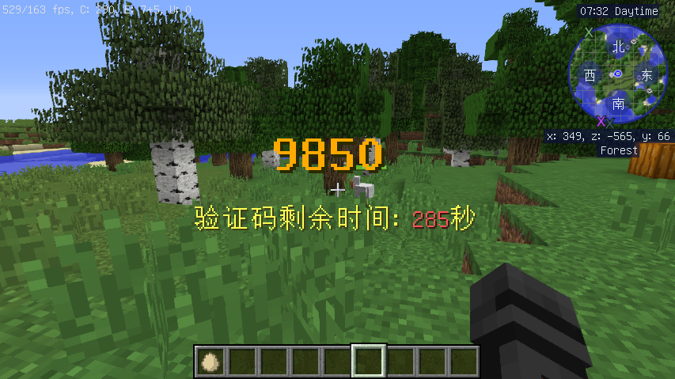
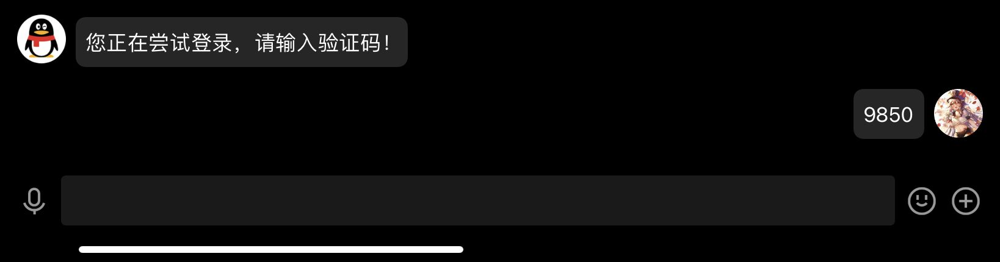
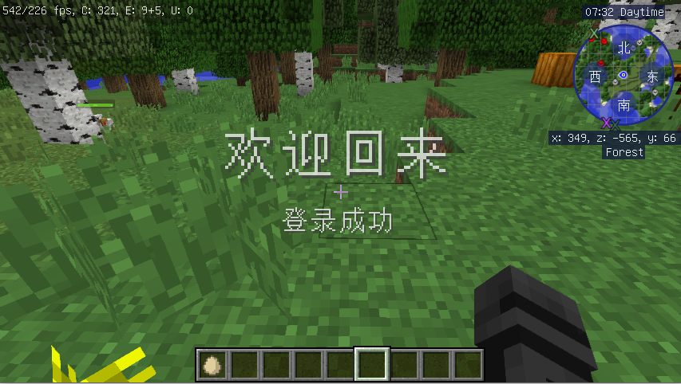

# QQLogin_Minecraft
### 在MC中使用QQ登录

## 依赖前置插件: [MiraiMC](https://github.com/DreamVoid/MiraiMC)

## 服主操作
### 1. 安装并配置 [MiraiMC](https://github.com/DreamVoid/MiraiMC/releases) 后安装本插件 [Release页面](https://github.com/MayFlyOvO/QQLogin_Minecraft/releases)
### 2. 邀请机器人进群
### 3. 运行服务器，插件会自动生成"config.yml"文件在“plugins/QQLogin"目录下
### 4. 配置"config.yml"文件中的QQ群信息，机器人QQ号信息等，详见文件中注释
### 5. 在控制台输入 **/qqlogin reload** 重载配置文件

## 玩家操作
### 1. 玩家第一次登录需要添加机器人为好友以及通过 **/qqlogin <QQ号>** 格式绑定QQ，机器人会自动通过好友请求
### 2. 玩家每次将屏幕显示的验证码，**私聊**发送给机器人即可登录

config.yml预览

游戏内效果预览

登录

登录成功

### 欢迎PR